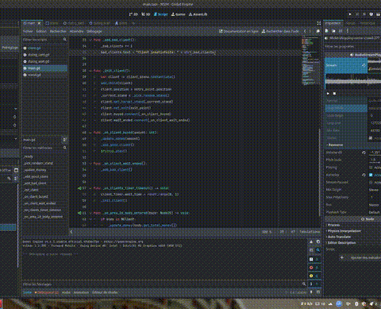

# NSIM - Simulation de Magasin

NSIM est un jeu de simulation et de gestion de magasin en 2D développé avec le moteur Godot Engine. Le joueur doit gérer les clients qui arrivent dans son magasin pour maximiser ses profits et la satisfaction de sa clientèle.

## 🎬 Trailer

## 🕹️ Concept du Jeu

Le but du jeu est de servir les clients qui se présentent aux différents stands de votre magasin. Vous devez être rapide et attentif pour ne pas les faire attendre trop longtemps !

### Mécaniques de jeu
1.  **Arrivée des clients :** Des clients apparaissent périodiquement et se dirigent vers un stand de manière autonome.
2.  **Phase d'attente :** Une fois arrivé à un stand, le client patiente. Une jauge (ou un état) indique son temps d'attente maximum.
3.  **Interaction :** Pour servir un client, le joueur doit **cliquer** sur lui avant la fin de son temps de patience.
4.  **Résultats :**
	*   **Client satisfait :** Si vous servez le client à temps, il effectue un achat. Votre argent augmente, ainsi que votre score de "clients satisfaits".
	*   **Client insatisfait :** Si le temps d'attente est écoulé avant que vous ne puissiez le servir, le client partira mécontent, ce qui incrémente le compteur de "clients insatisfaits".

Le défi est de gérer l'afflux de clients pour obtenir le meilleur score possible.

## 🚀 Comment Lancer le Projet

1.  Assurez-vous d'avoir **Godot Engine v4.4** ou une version plus récente.
2.  Clonez ou téléchargez ce projet.
3.  Ouvrez Godot Engine et cliquez sur **Importer**.
4.  Naviguez jusqu'au dossier du projet et sélectionnez le fichier `project.godot`.
5.  Une fois le projet importé, cliquez sur le bouton **Jouer** (▶️) en haut à droite de l'éditeur.

## 📂 Structure du Projet

Le projet est organisé comme suit :

-   `scenes/main/`: Contient la scène principale du jeu (`main.tscn`) et son script associé qui gère la logique globale (apparition des clients, score, etc.).
-   `objects/`: Renferme les scènes et scripts des différents éléments du jeu.
	-   `client/`: Logique du client (déplacement, attente, achat).
	-   `stand/`: Logique des stands de vente.
	-   `dialog/`: Composants UI qui apparaissent au-dessus des clients (temps d'attente, etc.).
-   `assets/`: Contient les ressources graphiques et sonores.
	-   `sfx/`: Effets sonores (achats, clients mécontents).
	-   `svgs/`: Icônes et autres éléments visuels.
-   `project.godot`: Le fichier principal de configuration du projet Godot.
